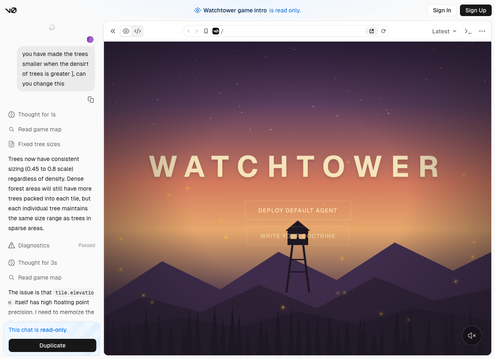

<p align="center">
  
</p>

<h1 align="center">WATCHTOWER</h1>

<p align="center">
  <strong>A Firewatch-inspired multi-agent wildfire command simulation.</strong><br />
  Write a doctrine, deploy autonomous agents, and watch them fight a live fire through map movement, radio chatter, air support, and terrain-aware decision-making.
</p>

## Summary

WATCHTOWER is an autonomous wildfire-command simulation built for Encode Club AI London 2026.

The player gives the system one thing: a firefighting doctrine. After that, the simulation runs on its own. A live orchestrator assigns missions, field agents execute them, aircraft lay water or retardant lines, the fire spreads according to wind and terrain, and the entire command chain is voiced as radio traffic and rendered on a live map.

This repo ships the full experience:

- a cinematic landing page and doctrine terminal
- a live game map with fire spread, routes, and aircraft runs
- a FastAPI backend with real session state and WebSocket streaming
- hierarchical agent planning with Kiro-backed orchestration
- ElevenLabs-powered radio chatter with walkie-talkie post-processing
- Luffa bot integration for relaying the incident into group chat

## Why It Stands Out

- **Autonomous from the moment you deploy.** Once the doctrine is submitted, the user is no longer issuing commands. The orchestrator, sub-agents, helicopters, ground crews, and air support act on their own.
- **Agents are legible, not hidden.** Decisions are exposed through live radio dialogue, route changes, visible unit movement, and a scrolling transcript rather than a black-box result screen.
- **The simulation is not fake UI.** Wind, slope, vegetation, water, fire intensity, firebreaks, and retardant all change what the agents can do and whether the village survives.
- **Different unit types behave differently.** Ground crews preserve themselves, route over terrain, avoid fire and water, and build containment lines. Helicopters suppress fire on arrival. Fixed-wing aircraft lay strategic straight-line drops to contain spread.
- **AI generation is the experience.** The point of the product is not a single AI button. The product is watching a generated command structure reason, speak, adapt, and fight the incident in real time.

## Core Experience

1. Enter a custom doctrine or deploy the default one.
2. The backend starts a live wildfire session with terrain, wind, village, units, and fire state.
3. A Kiro-backed orchestrator assigns missions to Ground 1, Ground 2, Alpha, Bravo, and optional fixed-wing air support.
4. The simulation validates those decisions against hard world rules.
5. Agents move across the map, suppress fire, build firebreaks, and call aircraft.
6. Every important command and outcome is spoken aloud and shown in the radio transcript.

## Tech Stack

| Layer | Stack |
| --- | --- |
| Frontend | Next.js 16, React 19, TypeScript, Tailwind 4 |
| Visuals | Canvas 2D map rendering, React Three Fiber, Drei, Three.js |
| Terrain generation | `simplex-noise` |
| Backend API | FastAPI, Uvicorn, WebSockets |
| Simulation | Python 3.12, deterministic wildfire engine, terrain-aware pathfinding |
| Agent system | Kiro CLI, LangGraph, Anthropic-compatible planner architecture, heuristic fallback |
| Voice | ElevenLabs with walkie-talkie audio post-processing via `ffmpeg` |
| Messaging | Luffa bot SDK |
| Weather | OpenWeather integration |
| Persistence | SQLite, SQLAlchemy, replay logs |
| Testing | Pytest, ESLint, Next build verification |

## Agentic Highlights

### Hierarchical command system

WATCHTOWER uses a layered planning model:

- **Orchestrator** decides strategic missions from full world state
- **Sub-agents** turn those missions into tactical unit commands
- **Simulation engine** validates every command against the real environment before execution

This gives the system both autonomy and control. The agents choose intent. The simulation remains the final authority.

### Terrain-aware behavior

The world is not a flat board. The live backend models:

- wind direction and speed
- vegetation and fuel
- elevation and uphill spread
- lakes and rivers that block fire
- ground-unit routing over safe terrain
- retardant and water strips that change future spread probability

Ground crews cannot simply teleport to objectives. They pathfind, prefer flatter terrain, avoid water, avoid fire, and can be killed if they end up inside an active burn.

### Live voiced radio

Every major decision becomes an in-world radio event:

- planner-issued unit orders
- air-support dispatches
- drop confirmations
- losses and high-signal alerts

These messages are:

- shown in the sidebar transcript
- synthesized with role-specific ElevenLabs voices
- post-processed to sound like radio traffic
- optionally mirrored into Luffa

### Visible autonomy

The agents do not only speak. Their decisions are visible:

- dotted target routes update on the map
- helicopters move to suppression points before dropping
- ground crews move toward containment lines and create firebreaks
- planes fly in, run a straight drop line, and leave treated terrain behind

## Hackathon Track Fit

### AI Agents

**Challenge fit:** WATCHTOWER is a genuinely autonomous multi-agent system. After the player submits a doctrine, the AI handles strategy, task allocation, field execution, adaptation, and communication without requiring a human to micromanage each step.

| Judging Criteria | Why WATCHTOWER fits |
| --- | --- |
| Autonomy | The user sets doctrine once, then the orchestrator and unit agents run the incident end to end. Commands are generated, validated, executed, and adapted automatically. |
| Usefulness | It works as a sandbox for exploring wildfire doctrine, autonomous coordination, and human-readable incident command behavior. It is a strong demo for emergency-response decision support and agent coordination under constraints. |
| Technical depth | The system combines hierarchical planning, WebSocket state streaming, simulation validation, terrain-aware pathfinding, radio pipelines, voice generation, and fallback behavior when planners fail or return unsafe actions. |
| Creativity | It turns agent reasoning into a playable Firewatch-style command drama where the AI is not just acting, but speaking, coordinating, and fighting a dynamic environment in real time. |

### Creative AI

**Challenge fit:** The core experience is AI-generated command and communication. The product is not a wrapper with a single generation feature bolted on. The live experience is the generation: doctrine-shaped decisions, radio dialogue, voices, tactical coordination, and emergent narrative.

| Judging Criteria | Why WATCHTOWER fits |
| --- | --- |
| Output quality | The generated output is operational rather than generic: role-specific radio chatter, doctrine-shaped tactics, and map-visible actions that line up with what the agents say. |
| User experience | The combination of cinematic landing page, doctrine terminal, live map, radio transcript, and voiced chatter makes the experience easy to understand and enjoyable to watch. |
| Originality | It is not another chat wrapper. It is a live AI command simulation where generated language, voice, and action are the whole product. |
| Technical execution | Kiro-backed planning, simulation state, WebSocket broadcasting, ElevenLabs synthesis, and radio post-processing are integrated into one continuous loop rather than isolated demos. |

### Vibe Coding

**Challenge fit:** This is an ambitious weekend build: frontend, backend, simulation engine, agent architecture, voice layer, radio UX, Luffa integration, and a cohesive aesthetic shipped together as one product.

| Judging Criteria | Why WATCHTOWER fits |
| --- | --- |
| What you shipped | A complete playable system with a custom landing page, doctrine flow, live simulation, autonomous units, air support, voiced radio, and integrated backend. |
| Speed and ambition | The project spans gameplay, systems design, simulation, UI, voice, messaging, and agent orchestration in one hackathon-sized build. |
| AI-assisted process | The build was iterated rapidly through AI-assisted workflows across product design, implementation, prompt design, gameplay tuning, and integration work. |
| Creativity | The idea is memorable and coherent: a Firewatch-inspired autonomous wildfire command center where the agents are both the brains and the performance. |

### LuffaNator

**Challenge fit:** WATCHTOWER includes a Luffa bot that can act as an incident relay and session companion rather than a passive chatbot.

| Judging Criteria | Why WATCHTOWER fits |
| --- | --- |
| Agentic automation | The bot can relay live radio lines, announce high-signal session events, and surface active incident state into a Luffa group without manual transcription. |
| Coordination | WATCHTOWER turns a live simulation into a shared channel experience, letting a group observe command decisions, unit status, and incident progress in real time. |
| External systems | The Luffa bot connects the simulation backend, radio pipeline, and live session manager into one operational workflow. |
| Real process value | Instead of a simple chat assistant, it behaves like a mission log and incident-ops relay layered on top of an autonomous simulation. |

## What The Environment Adds

The environment is a real part of the gameplay logic.

- **Wind** pushes spread in the direction of travel and makes downwind spread more dangerous.
- **Elevation** makes uphill spread faster and downhill spread slower.
- **Vegetation** changes fuel and flammability.
- **Water** blocks fire and ground movement.
- **Treated terrain** from water and retardant changes later spread behavior.

That means the agents are not selecting arbitrary targets. They are making decisions inside a world that pushes back.

## Running The Project

### Prerequisites

- Node.js
- Python 3.12
- `uv`
- `ffmpeg` for full radio post-processing

### Local run

```bash
npm install
uv sync
npm run dev
```

This starts:

- frontend on `http://localhost:3000`
- backend on `http://127.0.0.1:8000`

### Useful environment variables

- `ELEVENLABS_API_KEY`
- `OPENWEATHER_API_KEY`
- `LUFFA_ROBOT_KEY`
- `LUFFA_GROUP_UID`

## Project Docs

- [Game design document](docs/game.md)
- [Live agent and environment behavior](docs/live-agent-and-environment-behavior.md)
- [Project context](docs/watchtower-context.md)

## Short Pitch

WATCHTOWER turns autonomous agents into a live emergency-response performance. You do not micromanage units. You write doctrine, deploy command, and watch an AI incident team reason, speak, move, and fight to save the village.
